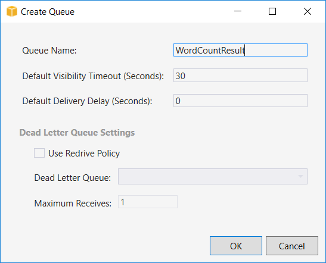

# AWS Lambda y .NET Core.

Instrucciones para el workshop "Desarrollo de funciones AWS Lambda con .NET Core", presentado en la [.NET Conf CO v2018](http://co.netconf.global/es), entre el 8 y el 10 de noviembre de 2018.

__Speakers__:
* Manuel Zapata
    * [@ManuelZapata](http://twitter.com/manuelzapata)
    * http://manuelzapata.co
* Leonardo Vargas
    * [@lvbernal](http://twitter.com/lvbernal)
    * http://lvbernal.com

__Requisitos__:
* [Visual Studio 2017](https://visualstudio.microsoft.com/downloads)
* [AWS Toolkit for Visual Studio 2017](https://marketplace.visualstudio.com/items?itemName=AmazonWebServices.AWSToolkitforVisualStudio2017)
* [Cuenta de Amazon Web Services](https://aws.amazon.com/)

# Introducción

En la primera parte del workshop aprenderá a crear y desplegar una función lambda desarrollada con .NET Core. Y en la segunda aprenderá a crear otra lambda que recibe el resultado de la primera desde una cola o _queue_ y lo envía a un servicio externo.

## Configuración

1. Ingrese al sitio [AWS Identity and Access Management (IAM)](https://console.aws.amazon.com/iam/home?region=us-east-1#/users).

2. Agregue un usuario con tipo de acceso _Programmatic access_.

    

3. Asigne la política _AdministratorAccess_ o _PowerUserAccess_. Para este demo, recomendamos la de administrador.

    

4. __Descargue__ el .csv con las credenciales y configure Visual Studio. Puede usar el ayudante que aparece cuando instala el _toolkit_ o desde el menú _View_, _AWS Explorer_.

    

# Primera parte

Lambda que cuenta las palabras de una cadena de texto.

1. Desde _File_, _New_, _Project_, cree un nuevo proyecto de tipo _AWS Lambda Project with Tests (.NET Core)_. Use la plantilla _Empty Function_.

    

2. Explore los archivos _aws-lambda-tools-defaults.json_ y _Function.cs_.

3. Agregue pruebas unitarias para la función. Es muy importante usar TDD en el desarrollo de lambdas.

    ``` C#
    using Xunit;
    using Amazon.Lambda.TestUtilities;

    namespace WordCount.Tests
    {
        public class FunctionTest
        {
            [Fact]
            public void TestCountFunction()
            {
                var function = new Function();
                var context = new TestLambdaContext();

                var cases = new [] {
                    ("hello world", 2),
                    ("hello .NET Conf CO v2018!", 5),
                    ("We invite you to the\nXamarin Cali Meetup", 8),
                    (null, 0),
                    (" hello   world ", 2),
                    ("   ", 0),
                    ("", 0)
                };

                foreach (var (input, expected) in cases)
                {
                    var count = function.FunctionHandler(input, context);
                    Assert.Equal(expected, count);
                }
            }
        }
    }
    ```

4. Escriba una función que reciba como parámetro un _string_ y cuente las palabras. El siguiente código se basa en el ejemplo [_Word Count_](https://code.visualstudio.com/docs/extensions/example-word-count) de Visual Studio Code.

    ``` C#
    using System;
    using System.Collections.Generic;
    using System.Linq;
    using System.Threading.Tasks;
    using System.Text.RegularExpressions;

    using Amazon.Lambda.Core;

    // Assembly attribute to enable the Lambda function's JSON input to be converted into a .NET class.
    [assembly: LambdaSerializer(typeof(Amazon.Lambda.Serialization.Json.JsonSerializer))]

    namespace WordCount
    {
        public class Function
        {

            /// <summary>
            /// A simple function that takes a string and counts its words
            /// </summary>
            /// <param name="input"></param>
            /// <param name="context"></param>
            /// <returns>Word count</returns>
            public int FunctionHandler(string input, ILambdaContext context)
            {
                if (input == null)
                {
                    return 0;
                }

                var content = input;

                content = Regex.Replace(content, @"(< ([^>]+)<)", "");
                content = Regex.Replace(content, @"\s+", " ");
                content = Regex.Replace(content, @"^\s\s*", "");
                content = Regex.Replace(content, @"\s\s*$", "");

                if (content == "")
                {
                    return 0;
                }
                else
                {
                    return content.Split(" ").Length;
                }
            }
        }
    }
    ```

5. Ejecute los _tests_ desde el menú _Test_, _Run_, _All Tests_.

6. Despliegue la función usando la opción _Publish to AWS Lambda_ que aparece el menú contextual del proyecto (click derecho); use el rol _AWSLambdaFullAccess_. Si no encuentra el rol, es probable que deba agregar la política _AdministratorAccess_, como recomendamos en el punto 3 de la sección de configuración.

    

7. Después de desplegar la función, es probable que haya cambiado el archivo _aws-lambda-tools-defaults.json_. Explore los cambios.

8. Use el _AWS Explorer_ (menú _View_, _AWS Explorer_) para probar la función.

    

# Segunda parte

Enviar el resultado a una cola de _Amazon SQS_.

1. Desde el _AWS Explorer_, cree una SQS.

    

2. Modifique el archivo _aws-lambda-tools-defaults.json_ y agregue la url de la cola a las variables de entorno. Usar variables de entorno le permitirá desacoplar el ambiente de desarrollo del de producción. Además, facilita los cambios en el flujo de la aplicación.

    ```
    "environment-variables": "{RESULT_QUEUE=SQS_QUEUE_URL}"
    ```

3. Modifique la función y el test para que la lógica de negocios quede aislada del _handler_. En este ejercicio no vamos a crear clases adicionales, pero eso es lo ideal.

    ``` C#
    public int FunctionHandler(string input, ILambdaContext context)
    {
        var result = CountWords(input);
        return result;
    }

    public int CountWords(string input)
    {
        if (input == null)
        {
            return 0;
        }

        var content = input;

        content = Regex.Replace(content, @"(< ([^>]+)<)", "");
        content = Regex.Replace(content, @"\s+", " ");
        content = Regex.Replace(content, @"^\s\s*", "");
        content = Regex.Replace(content, @"\s\s*$", "");

        if (content == "")
        {
            return 0;
        }
        else
        {
            return content.Split(" ").Length;
        }
    }
    ```

    ``` C#
    [Fact]
    public void TestCountFunction()
    {
        var function = new Function();

        var cases = new [] {
            ("Hello World", 2),
            ("Hello .NET Conf CO v2018!", 5),
            ("We invite you to the\nXamarin Cali Meetup", 8),
            (null, 0),
            (" Hello   World ", 2),
            ("   ", 0),
            ("", 0)
        };

        foreach (var (input, expected) in cases)
        {
            var count = function.CountWords(input);
            Assert.Equal(expected, count);
        }
    }
    ```


